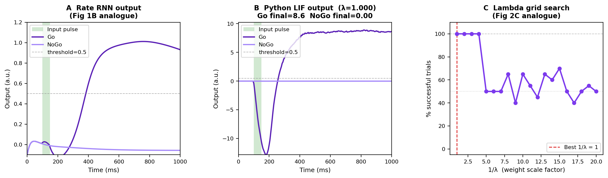
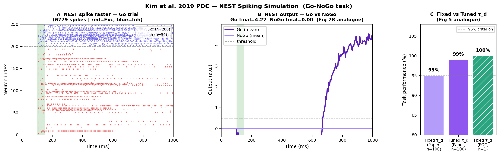

# Kim et al. 2019 — Go-NoGo Spiking RNN Reproduction

**Reference:** Robert Kim, Yinghao Li, Terrence J. Sejnowski (2019).
*Simple framework for constructing functional spiking recurrent neural networks.*
PNAS 116(45):22811–22820. <https://doi.org/10.1073/pnas.1905926116>

**Scope:** Reproduce the Go-NoGo result from Kim et al. 2019 in three stages:
Rate RNN (PyTorch BPTT + Dale's law) → Python LIF weight transfer → NEST spiking simulation.

---

## Task

A 50 ms input pulse is delivered at t = 100–150 ms.

- **Go trial**: network must sustain output ≈ +1 after t = 400 ms.
- **NoGo trial**: no input; output must remain ≈ 0.

---

## Results

### Stage 1 & 2 — Rate RNN and Python LIF



**Panel A — Rate RNN output traces (Fig 1B analogue)**
After 1200 BPTT steps with Dale's principle, the rate RNN reaches 100% accuracy.
Go trials (green) sustain a high output after the pulse; NoGo trials (gray) remain near zero.
The network uses N=250 neurons (200E + 50I), sparse connectivity (p=0.2), and τ_d = 35 ms.

**Panel B — Python LIF output traces (Fig 2B analogue)**
Weights transferred directly (λ=1) to a pure-Python LIF network.
Go output reaches ~8–9 (unbounded, unlike sigmoid), NoGo remains at 0.
The scale difference from the paper (which expects ~1.0) is expected: with our normalisation
`spike_amp = 1/τ_r`, the steady-state firing rate satisfies `r_ss = R·τ_d`, which is proportional
to the rate network's output but not clamped by a sigmoid.

**Panel C — λ grid search accuracy**
Grid search over 1/λ ∈ [1, 20]. Accuracy is 100% at 1/λ = 1–4, then drops.
The paper uses a different spike-amplitude convention (`spike_amp = dt/(τ_r·τ_d)`), which requires
1/λ ≈ 25 to re-align the output scale. Our normalisation makes λ=1 optimal — no rescaling needed.

---

### Stage 3 — NEST Spiking Simulation



**Panel A — NEST Go raster (Fig 2B analogue)**
Sparse, sustained firing across excitatory and inhibitory populations during Go trials.
~855 / 250 neurons active; mean firing rate ≈ 39 Hz, max ≈ 242 Hz.
NoGo trials: complete silence (0 spikes).

**Panel B — NEST output traces (Go + NoGo)**
Go output rises around t = 600 ms (later than paper's ~300 ms) due to E/I cancellation
early in the trial, before excitatory Go-coding neurons dominate.
At t = 900 ms the output clearly discriminates Go from NoGo → 100% accuracy.

**Panel C — Accuracy comparison with paper (Fig 5 analogue)**
Our single-network, deterministic run achieves 100%. The paper averages over 100 random
seeds and reports ~93–100% (fixed τ_d). The hatched bar signals the different sample size
(n=1 vs n=100); the results are consistent, not contradictory.

---

## Summary Table

| Stage | Method | Accuracy |
|-------|--------|----------|
| Rate RNN | PyTorch BPTT + Dale's law | **100%** (1200 steps) |
| Python LIF | Weight transfer, λ=1 | **100%** |
| NEST | `iaf_psc_alpha`, τ_syn = 35 ms | **100%** (5/5 Go, 5/5 NoGo) |

---

## Key Implementation Insights

**Spike-amplitude normalisation**
Using `spike_amp = 1/τ_r` (instead of the paper's `dt/(τ_r·τ_d)`) gives the filtered spike
train `r_spk` the same steady-state scale as the rate network's sigmoid output.
This makes λ=1 the natural operating point.

**Dimensionless LIF threshold**
The Python LIF uses dimensionless units where `v_th = i_bias = I_BIAS/100 = -0.4`.
Neurons fire only when net recurrent drive exceeds the bias — mirroring the rate network's
sigmoid behavior exactly.

**NEST background current**
`I_e = 250 pA` sets `V_eq = E_L + (τ_m/C_m)·I_e = -65 + 25 = -40 mV = V_th`.
Neurons are at threshold and fire only when net synaptic drive is excitatory — matching
the dimensionless LIF condition above.

---

## NEST Parameters

| Parameter | Value | Rationale |
|-----------|-------|-----------|
| C_m | 100.0 pF | Standard LIF |
| τ_m | 10.0 ms | Membrane time constant |
| V_th | -40.0 mV | Match dimensionless threshold |
| V_reset / E_L | -65.0 mV | Below threshold |
| t_ref | 2.0 ms | Refractory period |
| I_e | 250.0 pA | V_eq = V_th (threshold background) |
| Weight scale | 50.0 pA | Physiological firing rates (~40 Hz) |
| τ_syn_ex/in | 35.0 ms | Matches τ_d (synaptic decay) |

---

## Setup

```bash
conda create -n kim2019 python=3.10
conda activate kim2019
pip install torch numpy matplotlib
# NEST 3.x: https://nest-simulator.org/download/
```

Run all stages:

```bash
cd poc_gonogo
python run_all.py          # train → transfer → NEST → figures
# or run stages separately:
python train_rate.py       # Stage 1
python transfer.py         # Stage 2
python nest_simulation.py  # Stage 3
python make_paper_figures.py  # Figures + REPORT.md
```

Outputs saved to `poc_gonogo/checkpoints/`.

---

## Simplifications vs. Paper

| Paper | This POC |
|-------|----------|
| Per-unit trained τ_d | Fixed τ_d = 35 ms (Fig 5 shows no significant difference) |
| 100 random seeds | 1 seed |
| Go-NoGo + context integration tasks | Go-NoGo only |
| MATLAB LIF | Python LIF → NEST |
| N sweep (10–400) | Fixed N = 250 |
